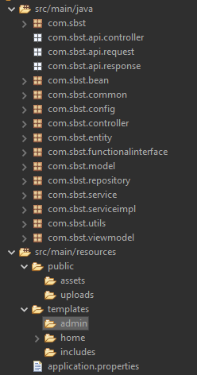
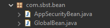

# Spring Boot - Spring Security - Thymeleaf Example

## Project Setup
Project sẽ sử dụng các thư viện sau
* Spring Web - Cấu hình sẵn ứng dụng web theo hướng restful, spring mvc và sử dụng ApacheTomcat làm webserver
* Spring Data JPA - Bộ api sử dụng đặc tả JPA
* Spring Security - Bảo mật web
* MySQL Driver - Driver kết nối tới csdl MySQL
* Thymeleaf - Template engine cho web
#### POM.XML
Các thư viện cần thiết
```xml
<?xml version="1.0" encoding="UTF-8"?>
<project xmlns="http://maven.apache.org/POM/4.0.0" xmlns:xsi="http://www.w3.org/2001/XMLSchema-instance"
	xsi:schemaLocation="http://maven.apache.org/POM/4.0.0 https://maven.apache.org/xsd/maven-4.0.0.xsd">
	<modelVersion>4.0.0</modelVersion>
	<parent>
		<groupId>org.springframework.boot</groupId>
		<artifactId>spring-boot-starter-parent</artifactId>
		<version>2.7.7</version>
		<relativePath/> <!-- lookup parent from repository -->
	</parent>
	<groupId>com.sbst</groupId>
	<artifactId>sbst</artifactId>
	<version>0.0.1-SNAPSHOT</version>
	<packaging>war</packaging>
	<name>sbst</name>
	<description>Spring Boot - Security - Thymeleaf Web full</description>
	<properties>
		<java.version>1.8</java.version>
	</properties>
	<dependencies>
		<dependency>
			<groupId>org.springframework.boot</groupId>
			<artifactId>spring-boot-starter-data-jpa</artifactId>
		</dependency>
		<dependency>
			<groupId>org.springframework.boot</groupId>
			<artifactId>spring-boot-starter-security</artifactId>
		</dependency>
		<dependency>
			<groupId>org.springframework.boot</groupId>
			<artifactId>spring-boot-starter-thymeleaf</artifactId>
		</dependency>
		<dependency>
			<groupId>org.springframework.boot</groupId>
			<artifactId>spring-boot-starter-web</artifactId>
		</dependency>
		<dependency>
			<groupId>org.thymeleaf.extras</groupId>
			<artifactId>thymeleaf-extras-springsecurity5</artifactId>
		</dependency>

		<dependency>
			<groupId>com.mysql</groupId>
			<artifactId>mysql-connector-j</artifactId>
			<scope>runtime</scope>
		</dependency>
		<dependency>
			<groupId>org.springframework.boot</groupId>
			<artifactId>spring-boot-starter-tomcat</artifactId>
			<scope>provided</scope>
		</dependency>
		<dependency>
			<groupId>org.springframework.boot</groupId>
			<artifactId>spring-boot-starter-test</artifactId>
			<scope>test</scope>
		</dependency>
		<dependency>
			<groupId>org.springframework.security</groupId>
			<artifactId>spring-security-test</artifactId>
			<scope>test</scope>
		</dependency>
	</dependencies>

	<build>
		<plugins>
			<plugin>
				<groupId>org.springframework.boot</groupId>
				<artifactId>spring-boot-maven-plugin</artifactId>
			</plugin>
		</plugins>
	</build>

</project>
```
#### application.properties file
Khi đã sử dụng thư viện spring data jpa thì phải khai báo thông tin kết nối đến database, nếu không khi run sẽ bị lỗi
```
# Server port
server.port=9090
server.error.path=/error

# Config resource static locatins (auto reload)
spring.web.resources.static-locations[0]=file:src/main/resources/public/
spring.web.resources.static-locations[1]=classpath:/public/

# Config max size file upload
spring.servlet.multipart.max-file-size=10MB

#Config datbase connection
spring.datasource.driverClassName=com.mysql.cj.jdbc.Driver
spring.datasource.url=jdbc:mysql://localhost:3306/spring-thymeleaf
spring.datasource.username=root
spring.datasource.password=
spring.jpa.database-platform = org.hibernate.dialect.MySQL5Dialect
spring.jpa.generate-ddl=true
spring.jpa.show-sql=true

## Hibernate ddl auto (create, create-drop, validate, update)
spring.jpa.hibernate.ddl-auto=update
```
#### Database
```sql
CREATE TABLE `customer` (
  `id` int(11) NOT NULL,
  `address` varchar(250) DEFAULT NULL,
  `age` int(11) NOT NULL,
  `email` varchar(50) NOT NULL,
  `name` varchar(50) NOT NULL,
  `sex` varchar(1) NOT NULL
)

CREATE TABLE `roles` (
  `id` int(11) NOT NULL,
  `role_name` varchar(255) DEFAULT NULL,
  `user_id` int(11) NOT NULL
) 

CREATE TABLE `users` (
  `id` int(11) NOT NULL,
  `password` varchar(32) NOT NULL,
  `username` varchar(20) NOT NULL
)
```
## Cấu trúc thư mục

### Entity
Tạo các entity mapping data cho các table trong database
* Customer.java
```java
@Entity
@Table(name = "customer", catalog = "spring-thymeleaf")
public class Customer implements Serializable {
  
	private static final long serialVersionUID = 1L;
	
	@Id
	@GeneratedValue(strategy = GenerationType.AUTO)
	private int id;
	
	@Column(name = "name", nullable = false, length = 50)
	private String name;
	
	@Column(name = "age", nullable = false)
	private int age;
	
	@Column(name = "sex", nullable = false, length = 1)
	private String sex;
	
	@Column(name = "email", nullable = false, unique = true, length = 50)
	private String email;
	
	@Column(name = "address", nullable = true, length = 250)
	private String address;
  
  // Contructor, geters and setters
}
```
* User.java
``` java
@Entity
@Table(name = "users", catalog = "spring-thymeleaf")
public class User implements Serializable {
	private static final long serialVersionUID = 1L;
	
	@Id
	@GeneratedValue(strategy = GenerationType.IDENTITY)
	private int id;
	
	@Column(name = "username", unique = true, nullable = false, length = 20)
	private String userName;
	
	@Column(name = "password", nullable = false, length = 32)
	private String password;
	
	@OneToMany(mappedBy = "user")
	private Set<Role> roles;
	
  // Contructor, geters and setters
}
```
* Role.java
```java
@Entity
@Table(name = "roles", catalog = "spring-thymeleaf")
public class Role implements Serializable {

	private static final long serialVersionUID = 1L;
	
	@Id
	@GeneratedValue(strategy = GenerationType.AUTO)
	private int id;
	
	@ManyToOne
	@JoinColumn(name = "user_id", nullable = false)
	private User user;
	
	@Column(name = "role_name")
	private String roleName;
  
  // Contructor, geters and setters
}
```
### Repository
Tạo các interface sử dụng đặc tả Jpa
```java
public interface UserRepository extends JpaRepository<User, Integer> {}
public interface RoleRepository extends JpaRepository<Role, Integer> {}
public interface CustomerRepository extends JpaRepository<Customer, Integer> {}
```
### Bean 


Cấu hình các dịch vụ sử dụng cho toàn trang web
```java
@Configuration
public class AppSecurityBean {
    
	@Autowired
	private UserDetailsService userDetailsService;
	
	@Bean(name = "authFailureHandler")
	public SimpleUrlAuthenticationFailureHandler authFailureHandler() {
		return new AuthFailureHandlerConfig();
	}

	@Bean(name = "authProvider")
	public DaoAuthenticationProvider authProvider() {
		DaoAuthenticationProvider authProvider = new DaoAuthenticationProvider();
		authProvider.setUserDetailsService(userDetailsService);
		authProvider.setPasswordEncoder(new BCryptPasswordEncoder());
		return authProvider;
	}
}

@Configuration
public class GlobalBean {
	
	@Autowired
	private RoleRepository roleR;
	
	@Autowired
	private UserRepository userR;
	
	@Bean(name = "loginPath")
	public String getLoginPath() {
		return Constants.LOGIN_PATH;
	}

	@Bean(name = "roles")
	public IRole getRoles() {
		return () -> roleR.findAll();
	}
	
	@Bean(name = "userLogin")
	public IUserLogin userLogin() {
		return () -> {
			Authentication auth = SecurityContextHolder.getContext().getAuthentication();

			if (!(auth instanceof AnonymousAuthenticationToken)) {
				UserDetails userDetails = (UserDetails) auth.getPrincipal();
				return userR.getByUsername(userDetails.getUsername());
			} else {
				return null;
			}
		};
	}
}
```
### Service, ServiceImpl
Service chứa các interface hoặc class xử lý data + logic business
ServiceImpl chức các lớp Implement các interface của Service. Khi sử dụng ta chỉ cần khai báo @Autowired trên các properties interface, khi chạy ứng dụng spring boot sẽ tự tìm kiếm các class Implement để sử dụng.
```java
// Sử dụng để kiểm tra đặng nhập và lưu thông tin đăng nhập
@Service
@Component
public class UserDetailService implements UserDetailsService {

	@Autowired
	private UserRepository ur;

	@Override
	public UserDetails loadUserByUsername(String username) throws UsernameNotFoundException {
		final com.sbst.entity.User user = ur.getByUsername(username);
		List<GrantedAuthority> authorities = new ArrayList<>();

		Set<Role> roles = user.getRoles();
		for (Role role : roles) {
			authorities.add(new SimpleGrantedAuthority(role.getRoleName()));
		}
		
		return new User(username, user.getPassword(), authorities);
	}
}
```

### Common/ Utils
Chứa các class hằng số hoặc các phương thức validate, Logic UploadFile etc..
```java
public class Constants {
	public final static String HOME_PATH = "/";	
	public final static String HOME_VIEW = "home/index";	
	public final static String CUSTOMER_PATH = "/customer";	
	public final static String CUSTOMER_VIEW = "customer/index";
	public final static String LOGIN_PATH = "/login";	
	public final static String LOGIN_VIEW = "login";	
	public final static String LOGOUT_PATH = "logout";
	public static final String UPLOAD_PATH_CONFIG = "src/main/resources/public/uploads";
}
```
```java
public class FileUploadUtil {
	public static void saveFile(String uploadDir, String fileName,
            MultipartFile multipartFile) throws IOException {
      Path uploadPath = Paths.get(Constants.UPLOAD_PATH_CONFIG + "/" + uploadDir);
      if (!Files.exists(uploadPath)) {
          Files.createDirectories(uploadPath);
      }         
      try (InputStream inputStream = multipartFile.getInputStream()) {
          Path filePath = uploadPath.resolve(fileName);
          System.out.println(filePath);
          Files.copy(inputStream, filePath, StandardCopyOption.REPLACE_EXISTING);
      } catch (IOException ioe) {
        ioe.printStackTrace();
          throw new IOException("Could not save image file: " + fileName, ioe);
      }      
  }
	public static void removeFile(String dir) {
		Path removePath = Paths.get(Constants.UPLOAD_PATH_CONFIG + "/" + dir);
		try {
			Files.deleteIfExists(removePath);
		} catch (IOException e) {
			// TODO Auto-generated catch block
			e.printStackTrace();
		}
	}
}
```
### Config
Cấu hình Security, WebMvc, etc...

* Cấu hình điều hướng khi thông tin đăng nhập sai
```java
public class AuthFailureHandlerConfig extends SimpleUrlAuthenticationFailureHandler {

	@Override
	public void onAuthenticationFailure(HttpServletRequest request, HttpServletResponse response,
			AuthenticationException exception) throws IOException, ServletException {
		getRedirectStrategy().sendRedirect(request, response, Constants.LOGIN_PATH + "?error=" + exception.getMessage()
				+ "&username=" + request.getParameter("username"));
	}
}

```
* Cấu hình các enpoint mặc định mà không cần thông qua controller
```java
@Configuration
public class WebMvcConfig implements WebMvcConfigurer {
	public void addViewControllers(ViewControllerRegistry registry) {
		registry.addViewController(Constants.HOME_PATH).setViewName(Constants.HOME_VIEW);
	}
}
```
* Cấu hình security
* Cấu hình này sử dụng xử lý đăng nhập, đăng xuất mặc định của spring security
```java
@Configuration
@EnableWebSecurity
public class WebSecurityConfig extends WebSecurityConfigurerAdapter {
	
	@Autowired
	private SimpleUrlAuthenticationFailureHandler authFailureHandler;
	
	@Autowired
	public DaoAuthenticationProvider authProvider;
	
	private void loginSuccessHandler(HttpServletRequest request, HttpServletResponse response,
			Authentication authentication) throws Exception {
		// do something when after login success
		response.sendRedirect(Constants.HOME_PATH);
	}

	private void logoutSuccessHandler(HttpServletRequest request, HttpServletResponse response,
			Authentication authentication) throws Exception {
		// do something when after logout success
		response.sendRedirect(Constants.HOME_PATH);
	}

	@Override
	protected void configure(HttpSecurity http) throws Exception {
		http.csrf().disable();
		http.authorizeRequests()
				.antMatchers(Constants.HOME_PATH).permitAll()
				
				;
				
		http.authorizeRequests()
				.anyRequest().permitAll();
		
		http.formLogin().loginPage(Constants.LOGIN_PATH).permitAll()
				.successHandler((request, response, authentication) -> {
					try {
						loginSuccessHandler(request, response, authentication);
					} catch (Exception e) {
						e.printStackTrace();
					}
				}).failureHandler(authFailureHandler);

		http.logout(logout -> logout
				.logoutUrl(Constants.LOGOUT_PATH)
				.logoutSuccessHandler((request, response, authentication) -> {
					try {
						logoutSuccessHandler(request, response, authentication);
					} catch (Exception e) {
						e.printStackTrace();
					}
				})
				.deleteCookies()
		).logout().permitAll();
	}

	@Override
	protected void configure(AuthenticationManagerBuilder auth) throws Exception {
		auth.authenticationProvider(authProvider);
	}
}
```
### Model/ ViewModel
Sử dụng làm object trung gian convert data 
```java
public class CustomerViewModel {
	private String name;
	private int age;
	private String sex;
	private String address;

	public CustomerViewModel(Customer customer) {
		this.name = customer.getName();
		this.age = customer.getAge();
		this.sex = customer.getSex();
		this.address = customer.getAddress();
	}
}
```
### Luồng hoạt động chính 
Vd cho page hiển thị danh sách Customer
```java
@Controller
public class CustomerController {
	@Autowired
	private CustomerService customerS;

	@GetMapping(Constants.CUSTOMER_PATH)
	public String get(Model model) {
		List<CustomerViewModel> customers = customerS.getAllCustomer();
		model.addAttribute("customers", customers);
		return Constants.CUSTOMER_VIEW;
	}
}
public class CustomerServiceImpl implements CustomerService{
	@Autowired
	private CustomerRepository customerR;

	@Override
	public List<CustomerViewModel> getAllCustomer() {
		List<Customer> customers = customerR.findAll();
		List<CustomerViewModel> customersVM = new ArrayList<>();
		for (Customer c : customers) {
			customersVM.add(new CustomerViewModel(c));
		}
		return customersVM;
	}
}
```
```java
<!-- View -->
<div th:each="item: ${customers}">
	<p th:text="${item.name}"></p>
	<p th:text="${item.age}"></p>
	<p th:text="${item.address}"></p>
</div>
```

#### Thông tin cấu hình và luồng hoạt động về cơ bản như trên
Để hiểu chi tiết hơn hãy follow code (Lưu ý code có thể không chạy).

* [Xem chi tiết hơn ở project bán hàng sử dụng cấu trúc như được trình bày](https://github.com/Dia2001/proxtech-shop)
* [Tìm hiểu thêm cấu trúc project spring boot - security cho api](https://github.com/ongcaoboi/springboot-hibernate-restful)

Cảm ơn đã theo dõi :v